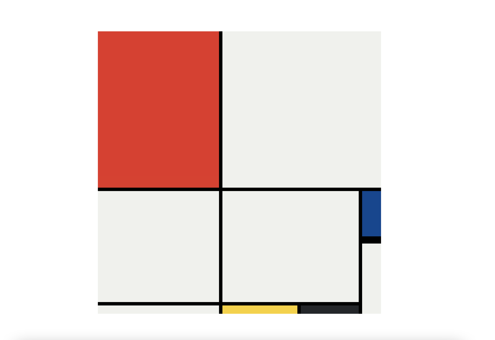

# Mondrian Composition Class Project

This website is a class project from the Web Development Bootcamp with Angela Yu.  

The goal of the project is to recreate Piet Mondrian's painting *Composition No III, with Red, Blue, Yellow, and Black* using the Grid system.

The project was accomplished using HTML and internal CSS.

See the [completed Grid Mondrian Composition](https://jatwong.github.io/mondrian_project/)

## Screenshot

